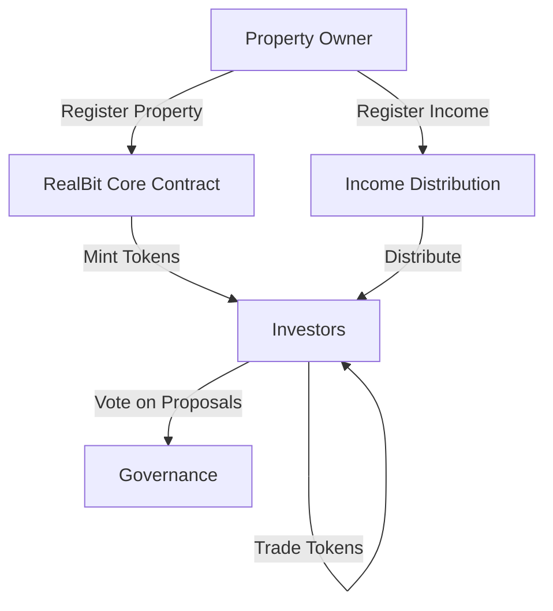

# RealBit Estate Fractionalization

A decentralized platform enabling fractional ownership of real estate properties through tokenization on the Stacks blockchain.

## Overview

RealBit revolutionizes real estate investment by:
- Tokenizing real-world properties into fungible digital assets
- Enabling fractional ownership with lower capital requirements
- Providing liquid secondary market trading
- Managing property governance through decentralized voting
- Facilitating transparent income distribution

The platform bridges traditional real estate with blockchain technology, making property investment more accessible while maintaining regulatory compliance.

## Architecture



### Core Components
1. **Property Registration** - Verified owners can register properties with details and token supply
2. **Token Management** - Handles minting and transfer of property tokens
3. **Governance System** - Enables token holders to create and vote on proposals
4. **Income Distribution** - Manages property income registration and distribution

## Contract Documentation

### RealBit Core Contract (`realbit-core.clar`)

#### Key Features
- Property registration and tokenization
- Token minting and transfer functionality 
- Governance proposal system
- Income distribution tracking
- Owner verification system

#### Access Control
- Contract Owner: Can manage verified owners and contract status
- Verified Property Owners: Can register properties and mint tokens
- Token Holders: Can transfer tokens and participate in governance

## Getting Started

### Prerequisites
- Clarinet for local development
- Stacks wallet for deployment

### Initial Setup
1. Deploy the contract
2. Add verified property owners
3. Register properties
4. Mint tokens to investors

## Function Reference

### Property Management
```clarity
(register-property (location (string-ascii 256)) (valuation uint) (annual-income uint) (total-supply uint))
(mint-property-tokens (property-id uint) (recipient principal) (amount uint))
(transfer-tokens (property-id uint) (recipient principal) (amount uint))
```

### Governance
```clarity
(create-proposal (property-id uint) (title (string-ascii 64)) (description (string-ascii 256)))
(vote-on-proposal (property-id uint) (proposal-id uint) (vote-for bool))
(execute-proposal (property-id uint) (proposal-id uint))
```

### Income Management
```clarity
(register-income-distribution (property-id uint) (amount uint))
```

### Administrative
```clarity
(add-verified-owner (owner principal))
(remove-verified-owner (owner principal))
(set-contract-enabled (enabled bool))
```

## Development

### Testing
1. Use Clarinet test framework
2. Test property registration flow
3. Test token operations
4. Test governance mechanisms
5. Test income distribution

### Local Development
```bash
# Initialize Clarinet project
clarinet new realbit-estate

# Run tests
clarinet test

# Start local development chain
clarinet console
```

## Security Considerations

### Limitations
- 14-day minimum holding period for tokens
- Minimum 5% token stake required for governance proposals
- Only verified owners can register properties
- Property owners must be verified by contract owner

### Best Practices
1. Always verify transaction success
2. Check token balances before transfers
3. Respect holding periods for transfers
4. Verify governance proposal timeframes
5. Ensure proper authorization for restricted functions

### Important Parameters
- `MIN-HOLDING-PERIOD`: 14 blocks
- `MIN-VOTING-STAKE`: 5% of total supply
- `VOTE-DURATION`: 1440 blocks (~10 days)
- `TOKEN-DECIMALS`: 6 decimal places